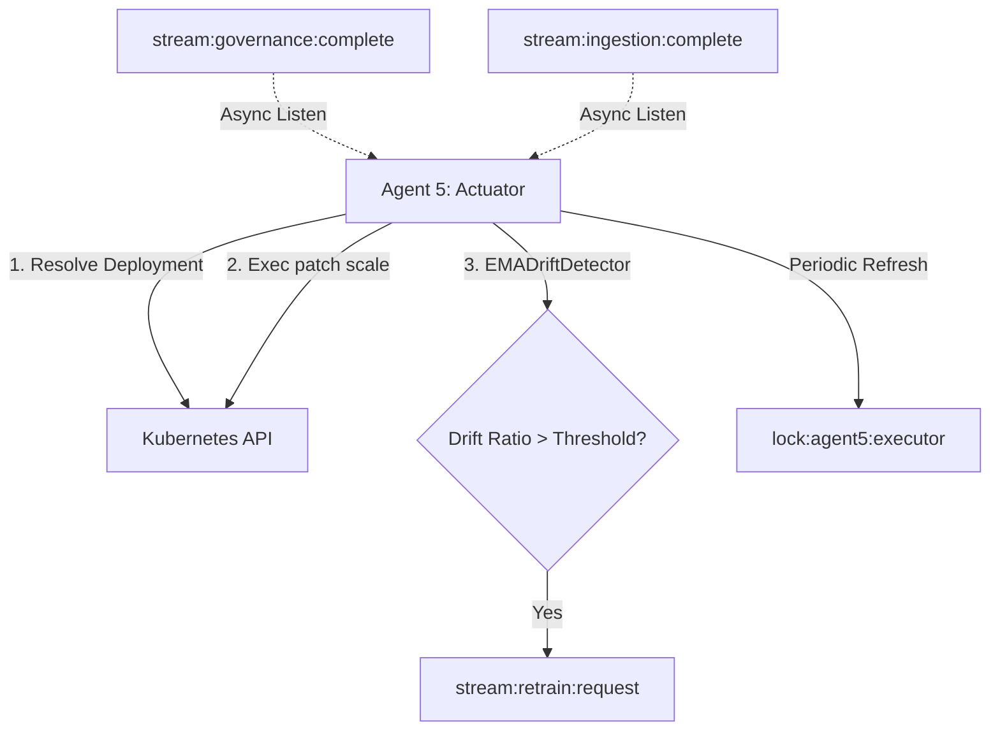

# Agent 5: Governance Scaling Actuator and Drift Monitor

## 1. Overview & Role in the Pipeline
Agent 5 (the **Actuator**) acts as the execution and monitoring terminal of the closed-loop automation pipeline. It bridges the gap between decision intelligence (optimization/governance) and physical infrastructure (Kubernetes workload deployment), while simultaneously monitoring live ingestion data for statistical anomalies (feature drift).

### Key Responsibilities
1. **Actuation**: Listens asynchronously to approved decisions on `stream:governance:complete` and scales target Kubernetes deployments.
2. **Drift Detection**: Analyzes live feature metrics published to `stream:ingestion:complete` using an Exponential Moving Average (EMA) detector. If features drift beyond configured thresholds, it triggers a model retraining event on `stream:retrain:request`.
3. **Locking & Single-Instance Safety**: Employs Redis-based locking to prevent distributed agent conflicts.

---

## 2. Architecture & Control Flow



---

## 3. Detailed Component Reference

### `K8sExecutor`
The core engine for interacting with the Kubernetes Cluster.
* **`resolve_deployment_name(pod_name, namespace)`**:
  * Resolves dynamic pod IDs (e.g., `stress-test-app-7758b96bd8-m86mg`) to their parent Deployment name (e.g., `stress-test-app`).
  * Queries the live Kubernetes API to traverse `OwnerReferences` recursively (Pod $\rightarrow$ ReplicaSet $\rightarrow$ Deployment).
  * If owner resolution fails, it falls back to a suffix-stripping heuristic.
* **`scale_deployment(deployment_name, namespace, replicas)`**:
  * Utilizes the `kubernetes` library to call `patch_namespaced_deployment_scale` on the target workload.
  * Ensures that live Kubernetes replicas align precisely with approved governance recommendations.

### `_RedisSingleInstanceLock`
Ensures thread and process safety across distributed nodes.
* **`acquire_or_exit()`**: Sets a unique key (`lock:agent5:executor`) in Redis with a time-to-live (TTL) of 30 seconds. Exits the process if the lock is held by another host/PID.
* **`refresh()`**: Periodically extends the lock lease TTL to prevent premature release during long-running streaming loops.

### Async Listeners
* **`run_governance_listener()`**:
  * Continuously reads from `stream:governance:complete`.
  * Filters for approved outcomes (e.g., `APPROVED` or `ESCALATED_TO_LLM` where the approval flag is `True`).
  * Initiates K8s scaling via `K8sExecutor`.
* **`run_drift_listener()`**:
  * Reads feature updates from `stream:ingestion:complete`.
  * Computes drift status against historical distribution profiles using `EMADriftDetector`.
  * If the drift ratio (drifting features divided by total features) exceeds the configured `feature_ratio` threshold, it publishes a retraining request payload to `stream:retrain:request`.

---

## 4. Configuration Parameters
Agent 5 loads configuration from `configs/training.yaml` for tuning feature drift parameters:
```yaml
drift_detection:
  alpha: 0.1             # Smoothing factor for EMA calculation
  z_threshold: 3.0       # Standard deviations to flag a feature as drifted
  feature_ratio: 0.2     # Percentage of total features that must drift to trigger retraining (20%)
```

---

## 5. Live E2E Verification Logs

### Scenario A: Feature Drift Detection & Retraining Feedback Loop
During live metrics ingestion, a drift ratio of **57.9%** (11 out of 19 features drifting) was observed:
```log
16:39:51 [INFO] [Drift] Updated features for test-workload/stress-test-app-7758b96bd8-m86mg. Current drift ratio: 57.9%
16:39:51 [INFO] Drift trigger #1: 11/19 features drifting (57.9%)
16:39:51 [WARNING] [Drift] Feature drift detected (ratio=57.9%). Publishing retraining request.
```
Agent 2 captured this message from `stream:retrain:request`, executed 5 epochs of fine-tuning, and updated the model checkpoint:
```log
2026-06-08 16:39:55,435 INFO  src.training.incremental_trainer  Fine-tuning for 5 epochs...
2026-06-08 16:39:59,151 INFO  src.training.incremental_trainer  Fine-tune complete in 3.7s
2026-06-08 16:39:59,160 INFO  src.training.incremental_trainer  Checkpoint updated at data/models/patchtst_multi.pt
2026-06-08 16:39:59,161 INFO  src.agents.prediction_agent       Fine-tune #day=1 complete. Weights hot-reloaded.
```
Upon the next ingestion check, the drift ratio returned to **0.0%**:
```log
16:40:51 [INFO] [Drift] Updated features for test-workload/stress-test-app-7758b96bd8-m86mg. Current drift ratio: 0.0%
```

### Scenario B: Kubernetes Scale-Up Actuation
A simulated scale-up decision targeting **3 replicas** was approved by Governance and handled by Agent 5:
```log
16:42:00 [INFO] --- Received Governance Decision 1780917120897-0 ---
16:42:00 [INFO] Decision: outcome=GovernanceOutcome.ESCALATED_TO_LLM | action=scale_up | replicas=3
16:42:00 [INFO] [K8s] Resolved pod stress-test-app-7758b96bd8-m86mg to Deployment stress-test-app
16:42:00 [INFO] [K8s] Successfully scaled deployment test-workload/stress-test-app to 3 replicas.
```
Validation via `kubectl`:
```bash
$ kubectl get deployment -n test-workload stress-test-app
NAME              READY   UP-TO-DATE   AVAILABLE   AGE
stress-test-app   3/3     3            3           134m
```

### Scenario C: Flapping Prevention (Governance-Level Intercept)
A scale-down request published within the 5-minute cooldown window was rejected:
```log
16:42:10 [INFO] --- Received Governance Decision 1780917130515-0 ---
16:42:10 [INFO] Decision: outcome=GovernanceOutcome.REJECTED | action=scale_down | replicas=3
16:42:10 [INFO] Governance decision rejected or hold. No scaling action executed.
```

### Scenario D: Kubernetes Scale-Down Actuation
Once the anti-flapping lease was cleared, the scale-down request was approved and executed successfully:
```log
16:42:22 [INFO] --- Received Governance Decision 1780917142223-0 ---
16:42:22 [INFO] Decision: outcome=GovernanceOutcome.APPROVED | action=scale_down | replicas=1
16:42:22 [INFO] [K8s] Resolved pod stress-test-app-7758b96bd8-m86mg to Deployment stress-test-app
16:42:22 [INFO] [K8s] Successfully scaled deployment test-workload/stress-test-app to 1 replicas.
```
Validation via `kubectl`:
```bash
$ kubectl get deployment -n test-workload stress-test-app
NAME              READY   UP-TO-DATE   AVAILABLE   AGE
stress-test-app   1/1     1            1           134m
```
