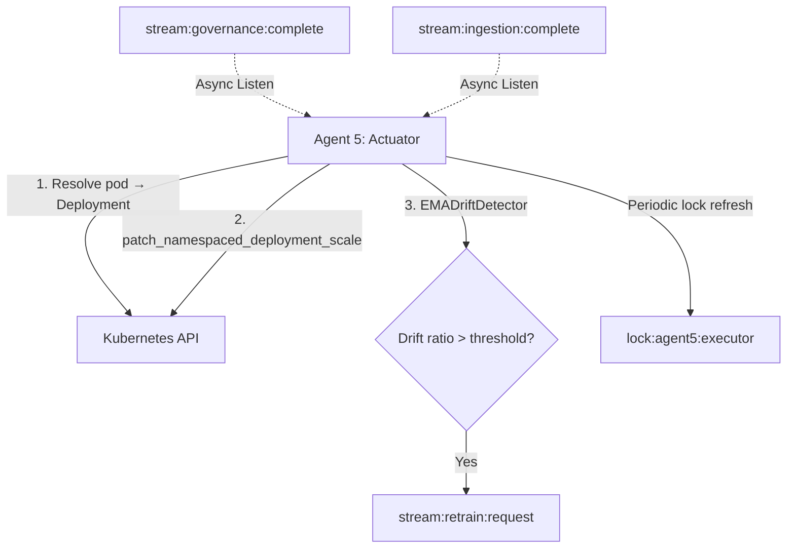

# Agent 5: Governance Scaling Actuator and Drift Monitor

## 1. Overview & Role in the Pipeline

Agent 5 is the execution and monitoring terminal of the closed-loop automation pipeline. It bridges the gap between Agent 4's approved governance decisions and the live Kubernetes cluster, while simultaneously monitoring ingested features for statistical drift.

### Key Responsibilities

1. **Actuation** — Listens on `stream:governance:complete` and scales Kubernetes Deployments when an action is approved
2. **Drift Detection** — Monitors `stream:ingestion:complete` with an EMA detector; publishes retraining requests to `stream:retrain:request` when >20% of features drift beyond threshold
3. **Single-Instance Safety** — Redis-based lock (`lock:agent5:executor`, 30s TTL) prevents duplicate execution

---

## 2. Architecture & Control Flow



---

## 3. Component Reference

### `K8sExecutor`

- **`resolve_deployment_name(pod_name, namespace)`**: Traverses `OwnerReferences` (Pod → ReplicaSet → Deployment). Falls back to heuristic suffix-stripping if traversal fails.
- **`scale_deployment(deployment_name, namespace, replicas)`**: Calls `patch_namespaced_deployment_scale` with the approved replica count.

### Governance Listener (`run_governance_listener`)

- Reads from `stream:governance:complete`
- Filters for approved outcomes: `APPROVED`, `APPROVED_WITH_CAP`, `ESCALATED_TO_LLM` with `approved=True`
- Calls `K8sExecutor.scale_deployment()`
- Logs all decisions (both approved and rejected)

### Drift Listener (`run_drift_listener`)

- Reads from `stream:ingestion:complete`
- Runs `EMADriftDetector` on the feature vector
- If drift ratio (drifting features / total features) > `feature_ratio` threshold → publishes retraining request to `stream:retrain:request`
- Agent 2 listens for these requests and triggers incremental fine-tuning

---

## 4. Configuration

From `configs/training.yaml`:

```yaml
drift_detection:
  alpha: 0.1          # EMA smoothing factor
  z_threshold: 3.0    # standard deviations to flag a feature as drifted
  feature_ratio: 0.2  # 20% of features must drift to trigger retraining
```

---

## 5. CLI Usage

```bash
python decision_agents/agent5/agent5_executor.py \
  --redis-host localhost \
  --redis-port 6380
```

The executor auto-detects the K8s environment (in-cluster ServiceAccount or `~/.kube/config` for local dev).

---

## 6. Live Verification Examples

### Scale-Up Actuation

```log
12:43:07 [INFO] --- Received Governance Decision 1781071987943-0 ---
12:43:07 [INFO] Decision details: outcome=APPROVED (approved=True) | action=scale_up | replicas=5 | target=test-workload/stress-test-app-9bcfc7b54-4wrrp
12:43:07 [INFO] [K8s] Resolved pod stress-test-app-9bcfc7b54-4wrrp to Deployment stress-test-app
12:43:07 [INFO] [K8s] Successfully scaled deployment test-workload/stress-test-app to 5 replicas.
```

### Scale-Down Actuation (after idle detection)

```log
12:43:07 [INFO] Decision details: outcome=APPROVED (approved=True) | action=scale_down | replicas=1 | target=test-workload/...
12:43:07 [INFO] [K8s] Successfully scaled deployment test-workload/stress-test-app to 1 replicas.
```

### Anti-Flapping Rejection (from Agent 4)

```log
[WARNING] Anti-flapping triggered. Rejecting scale-down during cooldown window.
[INFO] Governance decision rejected or hold. No scaling action executed.
```

### Feature Drift → Retraining

```log
[Drift] Updated features for test-workload/stress-test-app. Current drift ratio: 57.9%
[WARNING] [Drift] Feature drift detected (ratio=57.9%). Publishing retraining request.
```

Agent 2 then fine-tunes and hot-reloads:

```log
Fine-tuning for 5 epochs...
Fine-tune complete in 3.7s
Checkpoint updated at data/models/patchtst_multi.pt
Fine-tune #day=1 complete. Weights hot-reloaded.
```

---

## 7. Output

- Kubernetes deployment scale operations (live cluster)
- `stream:retrain:request` — triggers Agent 2 incremental fine-tuning
- Logs: `decision_agents/agent5/agent5_log.txt`
- Single-instance lock: `lock:agent5:executor`
